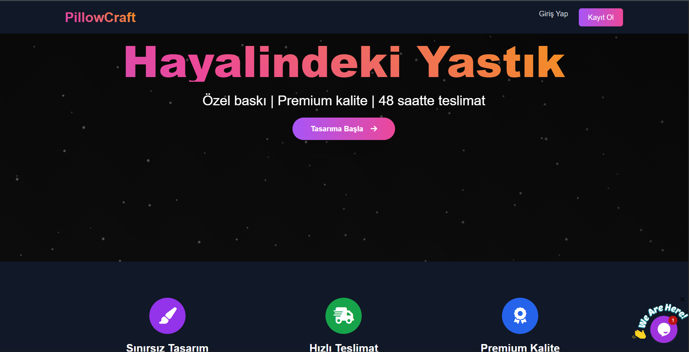

# Yastık Tasarlama E-Ticaret Sitesi

Bu proje, kullanıcıların kendi yastık tasarımlarını oluşturup sipariş verebilecekleri bir e-ticaret platformudur. Dinamik ve interaktif bir alışveriş deneyimi sunmayı hedefler.

## Özellikler

- **Kullanıcı Dostu Tasarım Arayüzü:** Kullanıcıların kolayca yastık tasarımları oluşturabilmesi için sezgisel bir arayüz.
- **Ürün Yönetimi:** Yönetici paneli üzerinden ürün ve tasarım seçeneklerini yönetme.
- **Sipariş Takibi:** Kullanıcıların siparişlerini takip edebilmesi.
- **Kullanıcı Hesapları:** Kayıt olma, giriş yapma ve profil yönetimi.
- **Güvenli Ödeme Entegrasyonu:** (Geliştirme aşamasında veya entegrasyon için hazır)

## Kullanılan Teknolojiler

- **Backend:** PHP
- **Veritabanı:** MySQL
- **Frontend:** HTML, CSS, JavaScript

## Kurulum

Bu projeyi yerel sunucunuzda çalıştırmak için aşağıdaki adımları izleyin:

1. Proje dosyalarını bir web sunucusuna (Apache, Nginx vb.) ve PHP desteği olan bir ortama kopyalayın.
2. Bir MySQL veritabanı oluşturun ve `u859419507_111.sql` dosyasını içe aktarın.
3. `includes/db.php` dosyasındaki veritabanı bağlantı bilgilerini kendi sunucu ayarlarınıza göre güncelleyin.

```php
<?php
$servername = "localhost";
$username = "your_username";
$password = "your_password";
$dbname = "your_database_name";

// Veritabanı bağlantısı oluştur
$conn = new mysqli($servername, $username, $password, $dbname);

// Bağlantıyı kontrol et
if ($conn->connect_error) {
    die("Bağlantı hatası: " . $conn->connect_error);
}
?>
```

4. Web sunucunuzu başlatın ve tarayıcınızdan projenizin ana dizinine erişin.

## Katkıda Bulunma

Projeye katkıda bulunmak isterseniz, lütfen bir `pull request` açmadan önce sorunları veya önerileri tartışmak için bir `issue` oluşturun.

## Lisans

Bu proje MIT Lisansı altında lisanslanmıştır. Daha fazla bilgi için `LICENSE` dosyasına bakın.


## Canlı Site

Projenin çalışan halini aşağıdaki bağlantıdan inceleyebilirsiniz:

[Özel Yastık Tasarlama E-Ticaret Sitesi](https://özelyastıktasarlama.shop/)

## Ekran Görüntüsü


